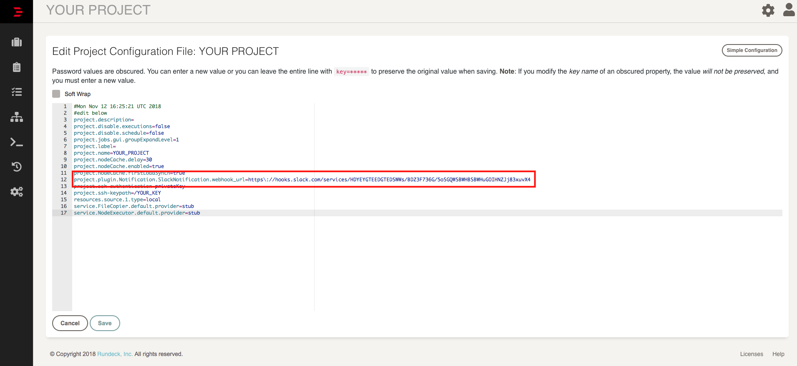

rundeck-slack-incoming-webhook-plugin
======================

Sends rundeck notification messages to a slack channel.  This plugin  is based on [rundeck-slack-plugin](https://github.com/bitplaces/rundeck-slack-plugin)(based on run-hipchat-plugin).

Installation Instructions
-------------------------

See the [Included Plugins | Rundeck Documentation](http://rundeck.org/docs/plugins-user-guide/installing.html#included-plugins "Included Plugins") for more information on installing rundeck plugins.

## Download jarfile

1. Download jarfile from [releases](https://github.com/higanworks/rundeck-slack-incoming-webhook-plugin/releases).
2. copy jarfile to `$RDECK_BASE/libext`

## Build

1. build the source by gradle.
2. copy jarfile to `$RDECK_BASE/libext`

### build with docker.

```
$ docker build -t rundeck-slack-incoming-webhook-plugin:latest .
$ docker run --rm -v `pwd`:/home/rundeck-slack-incoming-webhook-plugin rundeck-slack-incoming-webhook-plugin:latest
```

it creates `./build/libs/rundeck-slack-incoming-webhook-plugin-0.?.jar`

## Configuration

This plugin uses Slack incoming-webhooks. Create a new webhook and copy the provided url.

The only required configuration settings are:

- `WebHook URL`: Slack incoming-webhook URL. **Must** be set at the project (or global rundeck level)
   by editing the project properties file, either by going to `YOUR PROJECT > Project Settings > Edit Configuration > Edit Configuration File` and adding the webhook URL as show below:

   

   Or from your terminal to `/var/rundeck/projects/YOUR_PROJECT/etc/project.properties`. 
   
   Can be optionally overridden at the notification level. Failing to set this property at the project or rundeck level will prevent the
   plugin from firing the notification, even if a value is provided at the job level.

- `Custom template`: Can be used to apply a custom template to a specific notification.
   The template will be loaded from `/etc/rundeck`
   
### Custom notification templates

In case you need to customize the notifications, it's possible to do so by copying the
default templates from `src/resources/templates` to `/etc/rundeck` on the rundeck server.

The plugin will first try to read the template from `/etc/rundeck` first and, if not found, from itself.

## Slack message example.

On success.


On failure.


## Contributors
*  Original [hbakkum/rundeck-hipchat-plugin](https://github.com/hbakkum/rundeck-hipchat-plugin) author: Hayden Bakkum @hbakkum
*  Original [bitplaces/rundeck-slack-plugin](https://github.com/bitplaces/rundeck-slack-plugin) authors
    *  @totallyunknown
    *  @notandy
    *  @lusis
*  @sawanoboly
